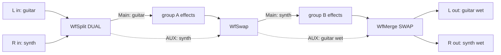
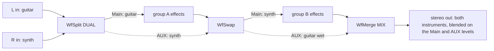
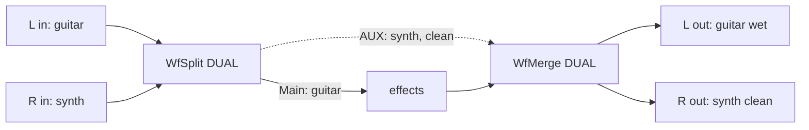
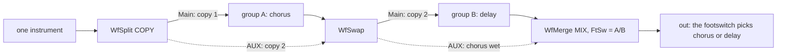
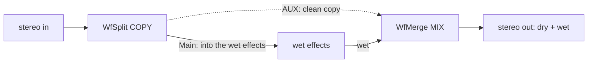
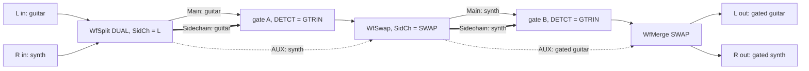

# Chain routing: the pedal's audio buses, and the effects that exploit them

The MS-70CDR+ runs its effect chain serially, but the firmware carries
more than one audio path through it. This doc is the confirmed bus
model and the recipes for routing effects (parallel dry/wet, channel
splitting) that the stock effects don't do. Everything labeled confirmed
was measured on an MS-70CDR+ with purpose-built probe effects.

Two warnings before anything else, both learned by crashing a real
pedal (see [SAFETY.md](../SAFETY.md)):

* Never write ctx[0][16..31] or the region above ctx[8]. Both are
  live firmware working memory (they read back as a repeating ~2756 Hz
  pattern). A single arm-gated, clamped, NaN-free write of plain zeros
  there killed the audio engine and then hard-froze the whole pedal.
  The location is the hazard, not the value.
* Never put a bus-WRITE mode on a swept selector knob. The pedal
  applies every intermediate value while a knob turns, so sweeping
  toward the mode you want briefly runs every mode in between (turning
  a Mode knob from 0 to 4 passes through 1, 2 and 3). If one of those
  intermediate modes writes to a bus, that write fires in passing,
  without you ever selecting it. If you experiment with bus writes,
  gate the write behind a separate on/off parameter that defaults to
  off and does nothing else. An on/off parameter has no intermediate
  values, so it cannot fire in passing. Two deliberate steps: set the
  selector to the mode you want first (nothing happens while the gate
  is off), then switch the write on.

## The buses

Block geometry everywhere: 16 float32 frames per channel per audio
call, channel A (left) at word offsets 0..15, channel B (right) at
16..31, 64-byte channel stride.

| Slot | What it is |
|---|---|
| ctx[0] | GTRIN, the pedal-input bus (the routing sections below call it Sidechain), exactly 16 words (mono only). Confirmed on hardware: at normal playing levels the firmware feeds this bus with one channel's content at unity gain, not a sum of both. With identical content on both jacks that looks like a sum, which is why early probing called it one; feeding genuinely different content per channel shows the truth, one channel arrives at full level and the other is silent. Which channel wins looks content-driven rather than jack-driven (the exact selection rule is not decoded). Above roughly -4 dBFS per channel the behavior breaks down into audible distortion and the two channels start blending, so treat anything near full scale as out of spec for this bus. No per-channel clean input exists anywhere on this pedal. The lower half is writable and propagates downstream within the block (mono only; the host refills it from the ADC every block). The upper half is the fatal region above. |
| ctx[1] | The effect bus (the routing sections below call it Main): the serial chain signal, processed in place by each effect, true stereo. |
| ctx[2] | The out bus (below: AUX): a real, shared, host-zeroed-per-block stereo bus that any effect can read and write. Writes persist to downstream effects within the block (execution is upstream-first). Exactly one stock effect touches it: the line selector, which ADDS `(1-K0)*K4*OutLvl*signal` into it every block. |
| ctx[7] | A one-word per-sample shuttle stock effects copy the current sample into (host metering, presumably). Skipping it is hardware-proven harmless. |
| ctx[8] | Holds no audio on this pedal (reads as zeros; older G-series decodes calling it the input buffer do not transfer). The region above it is the fatal firmware state. Never use. |

## The routing effects (recipes)

All shipped, all hardware-validated, all cleanroom sources in
`effects/`. Common rules: state is a few smoother floats,
every level kernel-smoothed per sample, out-bus access is exactly the 32
stock-touched words, and split/blend knobs use plain linear 0..1 so 100
= unity (the stock_vol 1.5x boost is for master-gain knobs only).

The model: the family runs the serial chain on one stereo bus and uses
a second, otherwise-empty stereo bus as a private parallel path. This
doc names the two the way the knobs on the effects do: **Main** is the
chain signal every effect processes, **AUX** is the carrier that rides
untouched past the effects in between, because no stock effect touches
it. (At the ABI level Main is the effect bus ctx[1] and AUX is the out
bus ctx[2].) WfSplit (head) fills both, WfSwap (middle) trades them,
WfMerge (tail) recombines them and always clears the AUX.

WfSplit's Mode decides what Main and AUX carry:

* **DUAL**: the L input goes to Main, the R input to AUX, each
  broadcast onto both channels of its bus. Two instruments, two
  independent mono paths.
* **COPY**: the whole stereo signal goes onto both buses. One signal,
  two parallel stereo paths.

The knobs. WfSplit's Main and AUX knobs trim the level into each bus
(100 = unity); WfMerge's Main and AUX are the two output level knobs.
WfMerge's
Mode picks the recombine: DUAL and SWAP assign the two paths to the
two output jacks (SWAP crossed; each path is folded (L+R)/2 onto its
jack), MIX sums the two paths into one stereo image. WfMerge's FtSw
repurposes the pedal's footswitch: BYP is normal bypass, A/B makes the
switch select which of the two paths you hear. The Sidechain pair:
WfSplit's SidCh chooses what the pedal's mono Sidechain bus carries
(L+R leaves the pedal's own choice, L or R force one input) with SidLv
as the Sidechain level (50 = unity), and WfSwap's SidCh = SWAP
re-points the Sidechain at the signal the swap just brought in, so an
effect detecting from the Sidechain after the swap follows its own
instrument. Every selector crossfades instead of clicking.

The recipes. In every diagram, left is on top: the L input and the L
output jack sit on the top row, so the Main bus runs along the top and
the AUX bus below it. Solid arrows are the Main bus (the effects in
the chain process it), dashed arrows the AUX bus (rides untouched),
thick arrows the mono Sidechain bus (drawn only where a Sidechain is
in play).

* **Two instruments, separate outs**: `[WfSplit DUAL] -> group A ->
  [WfSwap] -> group B -> [WfMerge SWAP]`. Guitar in L, synth in R,
  each through its own effects, each out its own jack:

* **Two instruments, one blended output**: the same rig with the tail
  in Mode MIX. Both processed instruments are summed into one stereo
  image on the merge's Main and AUX levels, a two-channel mixer:

* **One group, clean ride-through**: drop the swap, `[WfSplit DUAL] ->
  effects -> [WfMerge DUAL]`. The L instrument gets the effects, the R
  instrument rides through clean. With no swap, DUAL is the correct
  tail Mode. Included for completeness, I'm not sure how useful it is:

* **A/B footswitch**: the two-group rig with WfMerge's FtSw = A/B. One
  instrument through two different groups (chorus in A, delay in B,
  say, with Mode COPY at the split), and the footswitch chooses which
  one you hear, crossfaded, no gap:

* **Parallel dry/wet**: `[WfSplit COPY] -> wet effects ->
  [WfMerge MIX]`. Two routing slots buy a true-stereo parallel blend:
  the AUX copy stays clean, MIX sums it back in on the two level
  knobs.

* **Per-instrument gates**: the DUAL two-group rig with a noise gate in
  each group (DETCT = GTRIN), the split's SidCh on L, and the swap's
  SidCh on SWAP: each gate then detects from its own instrument, so
  stopping one never chokes the other:

The caveats, all hardware-proven:

* **Parity**: one WfSwap makes the parity odd, so after it Main
  carries what started on the AUX. The tail WfMerge must then be Mode
  SWAP, or the two signals come out of the wrong jacks.
* **MIX is a true sum**: both levels at 100 adds full-level dry to
  full-level wet, +6 dB, and it can clip. Set both near 50 for a unity
  blend, then trim.
* **In DUAL, a group is a mono path by design**: a mono-summing effect
  inside a group is harmless (both channels already carry the same
  signal), so most of the stock corpus is usable. A stereo widener at
  the group's end loses its width at the merge fold, and one built on
  phase differences can partially cancel there.
* **In COPY, width survives only while the wet path stays stereo**: a
  mono-summing effect in the wet group folds the image this rig exists
  to preserve.

One routing scheme per patch. The Split/Swap/Merge family uses the AUX
bus (ctx[2]) as inter-effect scratch, and it is the only DIY family this
release ships that touches it. A stock line selector ALSO writes ctx[2]
every block, so putting one in the same patch is a hazard: whichever one
runs later in the chain corrupts what the other wrote. Never combine
WfSplit/WfSwap/WfMerge with a stock line selector.

## Where these ideas came from

The routing concepts were pioneered on the previous pedal generation
(ZDL format) by ELynx, whose zoom-fx-modding project (GPL, concepts
learned from, no code or text reused) built a dry/wet mixer, a channel
splitter, and a mid-chain merger against the ZDL buses, and by the stock
line selector itself, the "Rosetta stone" whose off-state teleport
inspired the out-bus park. Two ZDL-generation facts explicitly do NOT
transfer to the MS+ pedals, both hardware-falsified here:

* The ZDL ctx slot numbering is different (their dry/effect/out buses
  at ctx[4]/[5]/[6] map to ctx[0]/[1]/[2] on the plus, and the block is
  16 frames, not 8).
* The ZDL trick of smuggling a true right channel through the dry bus's
  silent upper half is DEAD on the plus: here that "upper half" is the
  fatal firmware region. The out-bus park (WfSplit) is the plus-native
  replacement.

## Needs investigating

* What the static 2756 Hz firmware structure above ctx[0]/ctx[8]
  actually is, and which component dies when it's overwritten.
  Forensics only, never write there again.
* ctx[9]/ctx[10] semantics (read by several stock delays; ignorable,
  see [zd2-abi.md](zd2-abi.md)).
* Who writes the host-owned master-scale coefficient (coeff[4]).
